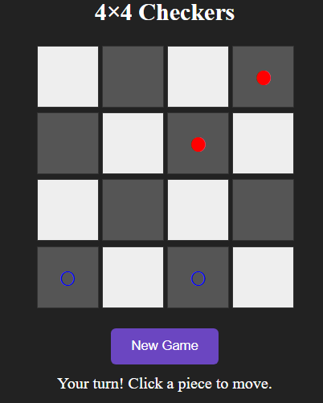
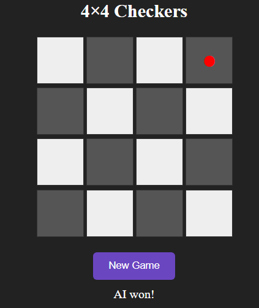

# 4×4 Checkers - Q-Learning Agent

A web-based 4×4 Checkers game where you can play against an AI powered by Q-Learning. This project demonstrates reinforcement learning applied to a simplified checkers environment.

---

## 📂 Project Structure

4by4checkers/
│
├─ backend/ # Flask backend with API endpoints and Q-table
├─ frontend/ # React frontend
├─ assets/ # Screenshots for README
├─ checkers.ipynb # Notebook with AI training (optional)
├─ README.md # This file
└─ .gitignore
 

---

## 🖼 Screenshots

**Game Board:**



**Agent Move Highlighted:**



---

## 🚀 Features

- Play a simplified 4×4 Checkers game against a Q-Learning AI.
- Agent makes intelligent moves based on a trained Q-table.
- Highlights valid moves for the player.
- Shows game status and winner.
- Reset game anytime.
- Agent can make the first move automatically.

---

## ⚙️ Getting Started

### Backend

1. Navigate to the backend folder:

```bash
cd backend
Install Python dependencies:

 
pip install -r requirements.txt
Run the Flask server:

 
python main.py
API will run on http://127.0.0.1:5000 with endpoints:

/api/new-game → Start a new game

/api/available-moves → Get available moves for a player

/api/make-move → Apply player's move

/api/agent-move → Get AI move

/api/health → Check server health

### Frontend

1. Navigate to the frontend folder:

 
cd frontend
Install Node.js dependencies:

 
npm install
Start the React development server:

 
npm start
Frontend will run on http://localhost:3000 and connect to the backend API.

📈 AI Agent
Q-Learning algorithm trained on a 4×4 board.

Stores learned values in q_table.pkl (backend).

Determines moves using the Q-table and epsilon-greedy strategy.

🔧 Requirements
Python 3.x

Node.js and npm

Flask, Flask-CORS, and other Python dependencies (see backend/requirements.txt)

React dependencies (see frontend/package.json)

📌 Notes
This is a simplified 4×4 version of Checkers for educational purposes.

Works locally with React frontend and Flask backend.

Screenshots are stored in the assets folder.